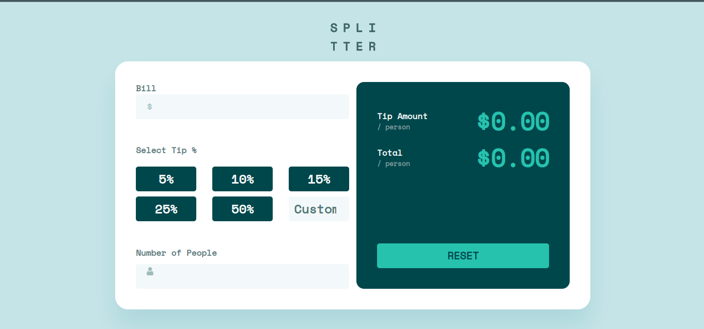

### The challenge

Users should be able to:

- View the optimal layout for the app depending on their device's screen size
- See hover states for all interactive elements on the page
- Calculate the correct tip and total cost of the bill per person

### Screenshot

### Links

- Solution URL: [https://github.com/levaniakobidze/tip-calculator](https://github.com/levaniakobidze/tip-calculator)
- Live Site URL: [https://tip-calculator-levan.vercel.app/](https://tip-calculator-levan.vercel.app/)

### Built with

- Semantic HTML5 markup
- CSS custom properties
- Flexbox
- Mobile-first workflow
- [React](https://reactjs.org/) - JS library
- [Css-modules] - For styles

## Author

- Website - [Portfolio](https://levaniakobidze.vercel.app/)
- Github - [Levan Iakobidze](https://github.com/levaniakobidze)
- Linkedin - [Levan Iakobidze](https://www.linkedin.com/in/levan-iakobidze-b0b60923b/)
